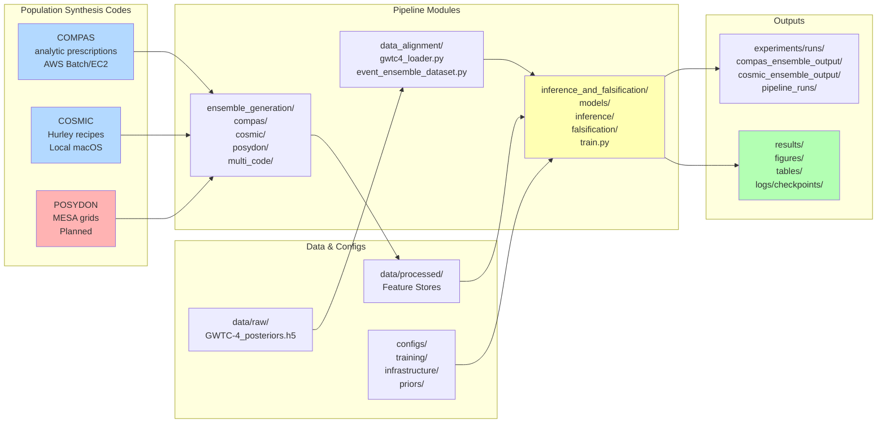
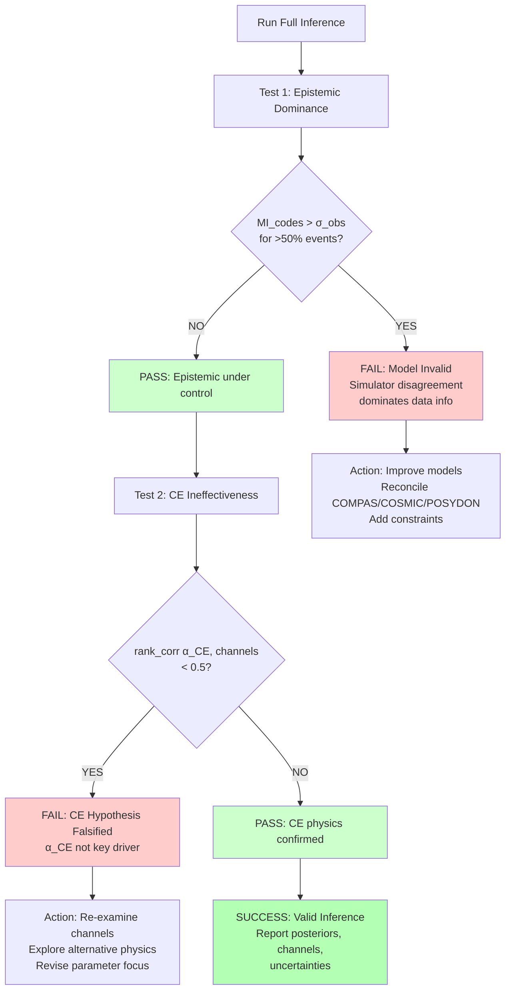

# ASTROTHESIS: Multi-Code GW Formation Channel Inference - Visual Architecture

**Purpose:** Comprehensive visual architecture diagram showing the end-to-end pipeline flow, components, and interactions.  
**Last Updated:** December 2025  
**Status:** COMPAS operational, COSMIC operational, POSYDON planned

---

## System Overview Diagram

```mermaid
graph TB
    subgraph "LAYER 1: POPULATION SYNTHESIS ENSEMBLE"
        A1[COMPAS<br/>Rapid Binary Evolution<br/>~10^6 binaries/model<br/>Status: Operational]
        A2[COSMIC<br/>Hurley-style Recipes<br/>~10^6 binaries/model<br/>Status: Operational]
        A3[POSYDON<br/>MESA-based Grids<br/>~10^4-10^5 binaries<br/>Status: Planned]
        
        GRID[Hyperparameter Grid<br/>α_CE, σ_kick, β_wind, Z<br/>Mass Transfer, Winds]
        
        GRID --> A1
        GRID --> A2
        GRID --> A3
    end
    
    subgraph "LAYER 2: SELECTION FUNCTION & OBSERVABLES"
        B1[Source → Detector Frame<br/>Mass Redshift<br/>Luminosity Distance]
        B2[Cosmology & Metallicity<br/>SFH, Z evolution<br/>Cosmic Time]
        B3[LIGO/Virgo Selection<br/>SNR Threshold<br/>Detection Probability]
        B4[Synthetic GW Catalog<br/>m1, m2, χ_eff, z, p_det]
        
        A1 --> B1
        A2 --> B1
        A3 --> B1
        B1 --> B2
        B2 --> B3
        B3 --> B4
    end
    
    subgraph "LAYER 3: REAL DATA INGESTION"
        C1[GWTC-4 Posteriors<br/>70+ Events<br/>m1, m2, χ_eff, distance]
        C2[Event Metadata<br/>Detector Network<br/>SNR, Uncertainties]
        
        C1 --> C2
    end
    
    subgraph "LAYER 4: DATA ALIGNMENT - DOMAIN ADAPTATION"
        D1[Event Encoder<br/>Latent Space Embedding]
        D2[Domain Adversarial Loss<br/>MMD / OT Alignment]
        D3[Aligned Latent Space<br/>Simulation ≈ Real]
        
        B4 --> D1
        C2 --> D1
        D1 --> D2
        D2 --> D3
    end
    
    subgraph "LAYER 5: NEURAL DENSITY ESTIMATION - SBI"
        E1[Event Encoder<br/>Per-Event Summary]
        E2[Population Aggregator<br/>Set-based Attention]
        E3[Cross-Modal Attention<br/>Events ↔ θ]
        E4[Normalizing Flow<br/>Density Estimator<br/>p θ | data]
        
        D3 --> E1
        E1 --> E2
        E2 --> E3
        E3 --> E4
    end
    
    subgraph "LAYER 6: FORMATION CHANNEL INFERENCE"
        F1[Channel Classification Head]
        F2[Isolated Binary IB]
        F3[Common-Envelope CE]
        F4[Chemically Homogeneous CHE]
        F5[Dynamical GC/NSC]
        F6[Other Subchannels]
        
        E4 --> F1
        F1 --> F2
        F1 --> F3
        F1 --> F4
        F1 --> F5
        F1 --> F6
    end
    
    subgraph "LAYER 7: UNCERTAINTY DECOMPOSITION"
        G1[Epistemic Uncertainty<br/>Cross-Code Disagreement<br/>MI Code; Observables]
        G2[Aleatoric Uncertainty<br/>Detector Noise<br/>Finite Sample Size]
        G3[Disagreement Phase Space<br/>Disagreement θ, z, O]
        
        A1 -.Model Variance.-> G1
        A2 -.Model Variance.-> G1
        A3 -.Model Variance.-> G1
        C1 -.Posterior Width.-> G2
        G1 --> G3
        G2 --> G3
    end
    
    subgraph "LAYER 8: FALSIFICATION FRAMEWORK"
        H1[Test 1: Epistemic Dominance<br/>MI_codes > σ_obs for >50% events<br/>→ Model Invalid]
        H2[Test 2: CE Ineffectiveness<br/>rank_corr α_CE, channels < 0.5<br/>→ Hypothesis Falsified]
        H3[Code Identification Head<br/>p code | O<br/>Learn Simulator Inductive Bias]
        
        G3 --> H1
        E3 -.Attention Weights.-> H2
        D3 --> H3
    end
    
    subgraph "LAYER 9: OUTPUTS & RESULTS"
        I1[Parameter Posteriors<br/>α_CE, σ_kick, β_wind, Z<br/>Credible Intervals]
        I2[Channel Fractions<br/>% IB, CE, CHE, Dyn<br/>Per-Event Probabilities]
        I3[Figures<br/>Mass/Spin/z Distributions<br/>Corner Plots<br/>Attention Heatmaps]
        I4[Tables<br/>Hyperparameters<br/>Falsification Verdicts<br/>Per-Event Classifications]
        I5[Uncertainty Metrics<br/>MI Values<br/>Epistemic vs Aleatoric<br/>Ranked Failure Modes]
        
        E4 --> I1
        F1 --> I2
        I1 --> I3
        I2 --> I3
        G3 --> I5
        H1 --> I4
        H2 --> I4
        H3 --> I5
    end
    
    style A1 fill:#e1f5ff
    style A2 fill:#e1f5ff
    style A3 fill:#ffe1e1
    style H1 fill:#ffcccc
    style H2 fill:#ffcccc
    style I1 fill:#e1ffe1
    style I2 fill:#e1ffe1
    style I3 fill:#e1ffe1
    style I4 fill:#e1ffe1
    style I5 fill:#e1ffe1
```

---

## Detailed Component Architecture



---

## Neural Architecture Detail

```mermaid
graph TD
    subgraph "Input Layer"
        SIM[Simulated Events<br/>Aligned Latents]
        REAL[GWTC-4 Events<br/>Aligned Latents]
    end
    
    subgraph "Event-Level Encoding"
        ENC[Event Encoder<br/>Per-event embedding<br/>MLP/Transformer]
        SIM --> ENC
        REAL --> ENC
    end
    
    subgraph "Population-Level Aggregation"
        AGG[Set Aggregator<br/>Attention Pooling<br/>DeepSets/Transformer]
        ENC --> AGG
    end
    
    subgraph "Cross-Modal Fusion"
        THETA[θ Hyperparameters<br/>Embedding]
        ATT[Cross-Attention<br/>Events ↔ θ<br/>Multi-Head Attention]
        AGG --> ATT
        THETA --> ATT
    end
    
    subgraph "Density Estimation"
        FLOW[Normalizing Flow<br/>Neural Spline Flow<br/>Masked Autoregressive]
        ATT --> FLOW
    end
    
    subgraph "Output Heads"
        POST[Posterior p θ | data<br/>Sampling & Density]
        CHAN[Channel Classifier<br/>Softmax over channels]
        DISC[Domain Discriminator<br/>Real vs Sim]
        
        FLOW --> POST
        ATT --> CHAN
        ENC --> DISC
    end
    
    subgraph "Loss Functions"
        L1[Negative Log-Likelihood<br/>-log p θ | x]
        L2[Channel Classification<br/>Cross-Entropy]
        L3[Domain Adaptation<br/>Adversarial + MMD]
        L4[Uncertainty Calibration<br/>Coverage + Sharpness]
        
        POST --> L1
        CHAN --> L2
        DISC --> L3
        POST --> L4
    end
    
    TOTAL[Total Loss<br/>λ1·L1 + λ2·L2 + λ3·L3 + λ4·L4]
    L1 --> TOTAL
    L2 --> TOTAL
    L3 --> TOTAL
    L4 --> TOTAL
    
    style POST fill:#b3ffb3
    style CHAN fill:#b3ffb3
    style TOTAL fill:#ffb3b3
```

---

## Data Flow Diagram

```mermaid
sequenceDiagram
    participant Grid as Hyperparameter Grid
    participant Sim as Population Synthesis<br/>(COMPAS/COSMIC/POSYDON)
    participant Sel as Selection Function
    participant Align as Domain Adaptation
    participant SBI as Neural SBI
    participant False as Falsification Tests
    participant Out as Outputs
    
    Grid->>Sim: Sample θ ~ p(θ)
    Sim->>Sel: Binary populations<br/>source frame
    Sel->>Sel: Apply cosmology,<br/>LIGO selection
    Sel->>Align: Synthetic GW catalog<br/>detector frame
    
    Note over Align: Load GWTC-4<br/>real posteriors
    
    Align->>Align: Encode to latent space<br/>adversarial alignment
    Align->>SBI: Aligned latents<br/>(sim + real)
    
    SBI->>SBI: Train event encoder,<br/>population aggregator,<br/>cross-attention, flow
    SBI->>SBI: Produce p(θ | D_GW)
    SBI->>Out: Posteriors, channel probs
    
    SBI->>False: Compute MI(code; obs)
    False->>False: Test 1: Epistemic dominance
    False->>False: Test 2: CE ineffectiveness
    False->>Out: Pass/Fail + diagnostics
    
    Out->>Out: Generate figures,<br/>tables, metrics
```

---

## Falsification Decision Tree



---

## File Structure Map

```
ASTROTHESIS/
│
├── 📁 pipelines/                        # Core pipeline logic
│   ├── ensemble_generation/             # Population synthesis
│   │   ├── compas/                      # COMPAS integration [✓]
│   │   ├── cosmic/                      # COSMIC integration [✓]
│   │   ├── posydon/                     # POSYDON integration [⏳]
│   │   └── multi_code/                  # Unified generator [✓]
│   ├── data_alignment/                  # Domain adaptation [✓]
│   │   ├── gwtc4_loader.py
│   │   └── event_ensemble_dataset.py
│   ├── inference_and_falsification/     # Neural SBI + tests
│   │   ├── models/                      # Architectures [✓]
│   │   ├── inference/                   # SBI framework [✓]
│   │   ├── falsification/               # Test criteria [✓]
│   │   └── train.py                     # Training loop [✓]
│   └── shared/                          # Utilities [✓]
│
├── 📁 configs/                           # YAML configurations
│   ├── training/pipeline/               # Training configs [✓]
│   ├── infrastructure/                  # Cluster specs [✓]
│   ├── priors/                          # Hyperparameter grids
│   └── simulator_templates/             # Code-specific args
│
├── 📁 data/                              # Data storage
│   ├── raw/                             # GWTC-4 posteriors [✓]
│   └── processed/                       # Feature stores
│
├── 📁 experiments/                       # Run artifacts
│   ├── runs/                            # Ensemble outputs [✓]
│   └── notebooks/                       # Research notebooks
│
├── 📁 results/                           # Outputs
│   ├── figures/                         # Publication plots
│   ├── tables/                          # CSV/LaTeX exports
│   └── logs/                            # Checkpoints [✓]
│
├── 📁 docs/                              # Documentation
│   ├── overview/                        # High-level docs [✓]
│   ├── operations/                      # Setup guides [✓]
│   └── simulator_notes/                 # Code-specific [✓]
│
├── 📁 simulators/                        # External codes
│   ├── compas/                          # COMPAS source [✓]
│   ├── cosmic/                          # COSMIC source [✓]
│   └── posydon/                         # POSYDON source [⏳]
│
└── 📁 tests/                             # Test suite
    ├── unit/                            # Unit tests [⏳]
    └── integration/                     # Smoke tests [✓]

Legend: [✓] Operational  [⏳] In Progress  [ ] Planned
```

---

## Training Loop Flow

```mermaid
flowchart TD
    START([Start Training])
    
    LOAD[Load Configuration<br/>configs/training/pipeline/default_config.yaml]
    START --> LOAD
    
    DATA[Load Data<br/>- GWTC-4 posteriors<br/>- Ensemble simulations<br/>COMPAS/COSMIC]
    LOAD --> DATA
    
    INIT[Initialize Models<br/>- Event Encoder<br/>- Population Aggregator<br/>- Cross-Attention<br/>- Normalizing Flow]
    DATA --> INIT
    
    EPOCH[Epoch Loop]
    INIT --> EPOCH
    
    BATCH[Sample Mini-Batch<br/>- Real events<br/>- Sim populations with θ]
    EPOCH --> BATCH
    
    FWD[Forward Pass<br/>1. Encode events → latents<br/>2. Aggregate population<br/>3. Cross-attend with θ<br/>4. Flow → p θ | x]
    BATCH --> FWD
    
    LOSS[Compute Losses<br/>L1: -log p θ | x<br/>L2: Channel classification<br/>L3: Domain adversarial<br/>L4: Calibration]
    FWD --> LOSS
    
    BACK[Backward Pass<br/>Gradients + Clipping<br/>Optimizer Step]
    LOSS --> BACK
    
    LOG{Log Metrics?<br/>Every N steps}
    BACK --> LOG
    LOG -->|Yes| TB[TensorBoard Logging<br/>Loss, MI, Posteriors]
    LOG -->|No| CHECK
    TB --> CHECK
    
    CHECK{Checkpoint?<br/>Every M epochs}
    CHECK -->|Yes| SAVE[Save Checkpoint<br/>Model state, optimizer<br/>results/logs/checkpoints/]
    CHECK -->|No| DONE
    SAVE --> DONE
    
    DONE{Epoch Complete?}
    DONE -->|More epochs| EPOCH
    DONE -->|Training complete| VAL
    
    VAL[Validation<br/>- Coverage tests<br/>- Posterior predictive checks]
    VAL --> INFER
    
    INFER[Inference on GWTC-4<br/>Generate p θ | D_GW]
    INFER --> FALSE
    
    FALSE[Run Falsification Tests<br/>Test 1: Epistemic dominance<br/>Test 2: CE ineffectiveness]
    FALSE --> EXPORT
    
    EXPORT[Export Results<br/>- Figures<br/>- Tables<br/>- Metrics]
    EXPORT --> END([End])
    
    style START fill:#b3d9ff
    style END fill:#b3ffb3
    style FALSE fill:#ffb3b3
    style EXPORT fill:#b3ffb3
```

---

## Epistemic Uncertainty Decomposition

```mermaid
graph TB
    subgraph "Multi-Code Ensemble"
        C1[COMPAS<br/>θ → O_COMPAS]
        C2[COSMIC<br/>θ → O_COSMIC]
        C3[POSYDON<br/>θ → O_POSYDON]
    end
    
    subgraph "Disagreement Analysis"
        MI[Mutual Information<br/>I code; O | θ, z]
        STRAT[Stratified MI<br/>by θ bins<br/>by z bins<br/>by mass bins]
        PHASE[Disagreement Phase Space<br/>D θ, z, O]
        
        C1 --> MI
        C2 --> MI
        C3 --> MI
        MI --> STRAT
        STRAT --> PHASE
    end
    
    subgraph "Code Identification"
        HEAD[Code ID Head<br/>p code | O]
        FEAT[Feature Importance<br/>Which O reveal code?]
        
        C1 --> HEAD
        C2 --> HEAD
        C3 --> HEAD
        HEAD --> FEAT
    end
    
    subgraph "Uncertainty Attribution"
        EPIST[Epistemic<br/>Model Disagreement<br/>Cross-Code Variance]
        ALEAT[Aleatoric<br/>Detector Noise<br/>Finite Sample]
        
        PHASE --> EPIST
        FEAT --> EPIST
    end
    
    subgraph "Falsification"
        T1{MI > σ_obs<br/>for >50% events?}
        EPIST --> T1
        T1 -->|YES| REJECT[REJECT MODEL<br/>Epistemic dominates]
        T1 -->|NO| ACCEPT[ACCEPT MODEL<br/>Proceed to inference]
    end
    
    subgraph "Diagnostics"
        D1[Ranked Failure Modes<br/>High MI at all α_CE → CE inconsistent<br/>MI only at low Z → winds diverge<br/>MI for high χ_eff → spin assumptions]
        D2[Physical Interpretation<br/>Which physics causes disagreement?]
        
        PHASE --> D1
        D1 --> D2
    end
    
    style REJECT fill:#ffcccc
    style ACCEPT fill:#ccffcc
    style D2 fill:#ffffcc
```

---

## Technology Stack

| Layer | Technology | Purpose |
|-------|-----------|---------|
| **Population Synthesis** | COMPAS (C++), COSMIC (Python), POSYDON (Python+MESA) | Generate binary evolution populations |
| **Data Processing** | PyTorch, NumPy, Pandas, h5py | Tensor operations, data manipulation, HDF5 I/O |
| **Neural Networks** | PyTorch, `nflows` library | Event encoders, transformers, normalizing flows |
| **SBI Framework** | `sbi` (PyTorch-based), custom NPE | Neural density estimation, amortized inference |
| **Visualization** | Matplotlib, Seaborn, corner.py | Figures, corner plots, attention heatmaps |
| **Logging** | TensorBoard, YAML configs | Training metrics, reproducibility |
| **Compute** | AWS Batch/EC2 (COMPAS), Local macOS (COSMIC) | Distributed simulation, prototyping |
| **Version Control** | Git, `.gitignore` for data/logs | Code tracking, collaboration |

---

## Current Status Summary

| Component | Status | Notes |
|-----------|--------|-------|
| COMPAS Integration | ✅ Operational | AWS setup complete, production grid pending |
| COSMIC Integration | ✅ Operational | Fast local prototyping, sparse grids generated |
| POSYDON Integration | ⏳ In Progress | CLI wrapper ready, awaiting grid download |
| Multi-Code Generator | ✅ Operational | Unified runner for COMPAS + COSMIC |
| GWTC-4 Loader | ✅ Operational | Posterior samples ingested, dataset ready |
| Domain Adaptation | ✅ Implemented | Adversarial + MMD alignment |
| Event Encoder | ✅ Implemented | MLP + attention-based |
| Population Aggregator | ✅ Implemented | DeepSets-style pooling |
| Cross-Modal Attention | ✅ Implemented | Events ↔ θ attention |
| Normalizing Flow | ✅ Implemented | Neural spline flow density estimator |
| Training Loop | ✅ Functional | End-to-end with checkpointing, logging |
| Falsification Tests | ✅ Implemented | Test 1 & 2 criteria coded |
| Production Ensembles | ⏳ In Progress | COMPAS grid on AWS pending deployment |
| Full Inference Run | ⏳ Pending | Awaiting production ensemble data |
| Publication Outputs | ⏳ Pending | Figures/tables post-full run |

---

## Key Novelties

1. **Multi-Simulator Ensemble as Prior**: Treats code diversity as structured epistemic uncertainty, not noise
2. **Domain Adaptation for GW Data**: Explicit alignment of simulations with real LIGO/Virgo posteriors
3. **Physics-Informed Neural SBI**: Cross-attention for interpretability, parameter-conditioned flows
4. **Built-In Falsification**: Explicit pass/fail criteria (epistemic dominance, CE ineffectiveness)
5. **Disagreement Phase Space**: Maps where and why simulators diverge → actionable physics insights
6. **Ranked Failure Modes**: Not just "reject model" but "why and where it fails"
7. **Code Identification Head**: Learns simulator inductive biases from observables

---

## References to Documentation

- **Scientific Context**: [`PIPELINE_README.md`](overview/PIPELINE_README.md), [`SCIENTIFIC_POSITION.md`](overview/SCIENTIFIC_POSITION.md)
- **System Design**: [`ARCHITECTURE.md`](overview/ARCHITECTURE.md), [`PROJECT_SUMMARY.md`](overview/PROJECT_SUMMARY.md)
- **Operations**: [`SETUP.md`](operations/SETUP.md), [`QUICKSTART.md`](operations/QUICKSTART.md), [`AWS_CLUSTER.md`](operations/AWS_CLUSTER.md)
- **Simulator Integration**: [`COMPAS_Info.md`](simulator_notes/COMPAS_Info.md), [`COSMIC_INTEGRATION.md`](simulator_notes/COSMIC_INTEGRATION.md), [`POSYDON_INTEGRATION.md`](simulator_notes/POSYDON_INTEGRATION.md)

---

## Next Steps

1. **Deploy COMPAS Production Grid** (AWS Batch, 40 combinations)
2. **Execute Full Training Run** (COMPAS + COSMIC ensembles)
3. **Run Falsification Tests** (Populate `results/tables/falsification/`)
4. **Cross-Code MI Study** (Epistemic uncertainty quantification)
5. **Generate GWTC-4 Event-Level Outputs** (Channel posteriors, attention viz)
6. **Activate POSYDON** (Download grids, validate, integrate)
7. **Prepare Publication** (Figures, tables, preprint draft)

---

**END OF VISUAL ARCHITECTURE**


